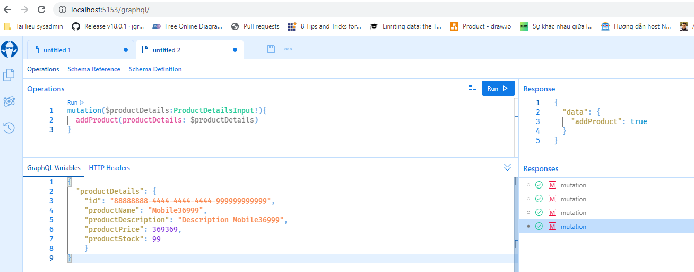

- Get a Product List 
    - query{
        productList{
            id
            productName
            productDescription
            productPrice
            productStock
        }
    }
- Add Product Detail
    - mutation($productDetails:ProductDetailsInput!){
        addProduct(productDetails: $productDetails)  
        }
    - Parameter Input:
        {
            "productDetails": 
            {
                "id": "88888888-4444-4444-4444-999999999999",
                "productName": "Mobile36999",
                "productDescription": "Description Mobile36999",
                "productPrice": 369369,
                "productStock": 99
                }
        }
    - 
- Update Product Detail
    - mutation($productDetails:ProductDetailsInput!){
        updateProduct(productDetails: $productDetails)  
        }
    - Parameter Input:
        {
        "productDetails": {
            "id": "5933dc1e-03ef-457b-be6e-35a3d5ef23c4",
            "productName": "Mobile36999",
            "productDescription": "Description Mobile36999",
            "productPrice": 369369,
            "productStock": 99
            }
        }
- Delete Product Detail
    - mutation($productId:UUID!){
            deleteProduct(productId: $productId)  
        }
    - Parameter Input:
        {
            "productId": "5933dc1e-03ef-457b-be6e-35a3d5ef23c4"
        }
- Get Product Detail by Id
    - {
        productDetailsById(productId: "478b4df0-e8ed-415f-a8e3-2ba84c31ec2b") 
        {
            id
            productName
            productDescription
            productPrice
            productStock
        }
    }